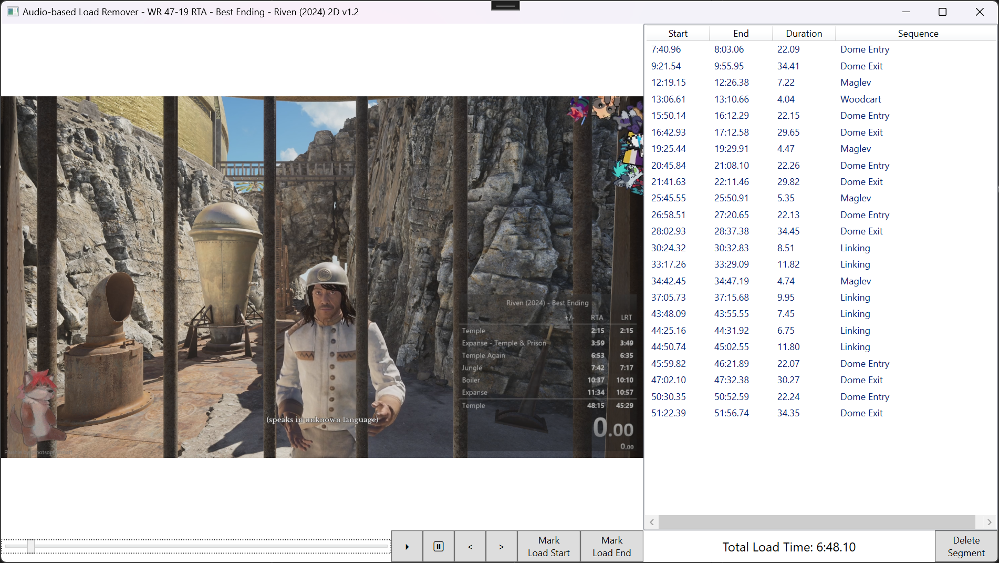

# Audio Load Remover

Uses audio clips to remove load times from a speedrun video.

For now, this only works for Riven (2024), but it's built in a generic way that
should be compatible with any game that has audio cues.

## Riven (2024)

We can detect the following loads:

1. Linking
1. Entering a dome
1. Exiting a dome
1. Riding a Maglev
1. Riding a Minecart

Here's a "Best Ending - Glitchless" run, with a total detected load time of
6:48:10. This load time can be subtracted from the RTA of 47:19 for a LRT of
40:31.

Here are the exact audio (and sometimes visual cues) for each type of load.

### Linking

The load starts when the linking sound starts playing. The load ends very
shortly after arriving at the destination (when the background ambiance audio
starts to play).

https://github.com/jabberrock/AudioLoadRemover/raw/master/Riven/load-linking.mp4

### Entering a dome

The load starts when the outer dome fully closes and you hear a "clunk". The
load ends when the inner door starts to open.

https://github.com/jabberrock/AudioLoadRemover/raw/master/Riven/load-enter-dome.mp4

### Exiting a dome

The load starts when the inner door starts to close and you hear a sound like
chains being dragged. The load ends when the outer dome fully opens and you hear a "clunk".

https://github.com/jabberrock/AudioLoadRemover/raw/master/Riven/load-exit-dome.mp4

### Riding a Maglev

The load starts when the vehicle audio starts (shortly after the vehicle starts
moving). The load ends very shortly after arriving at the destination (when the
background ambiance audio starts to play).

https://github.com/jabberrock/AudioLoadRemover/raw/master/Riven/load-maglev.mp4

### Riding a Minecart

The load starts when the vehicle audio starts (shortly after the vehicle starts
moving). The load ends very shortly after arriving at the destination (when the
background ambiance audio starts to play).

https://github.com/jabberrock/AudioLoadRemover/raw/master/Riven/load-woodcart.mp4
